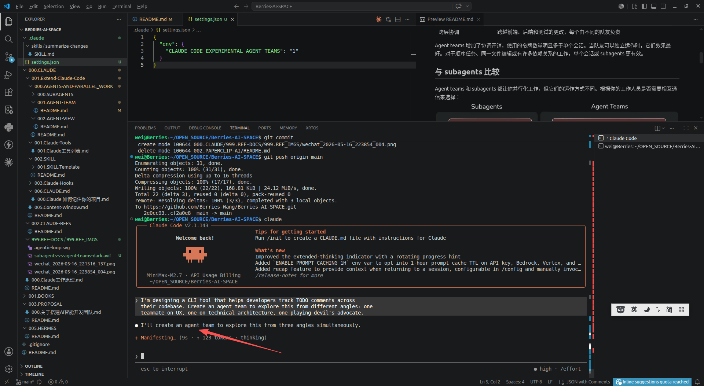

# agent team
协调多个 Claude Code 实例作为一个团队一起工作，具有共享任务、代理间消息传递和集中管理。

Agent teams 让你协调多个 Claude Code 实例一起工作。一个会话充当团队负责人，协调工作、分配任务和综合结果。队友独立工作，每个都在自己的 context window 中，并直接相互通信。

与 subagents 不同，subagents 在单个会话中运行，只能向主代理报告，你也可以直接与个别队友互动，无需通过负责人。

## Agent Team使用场景
Agent teams 最适合用于并行探索能增加真实价值的任务。
|场景|描述|备注|
|-|-|-|
|研究和审查|多个队友可以同时调查问题的不同方面，然后分享和质疑彼此的发现|
|新模块或功能|队友可以各自拥有一个独立的部分，不会相互干扰|
|使用竞争假设进行调试|队友并行测试不同的理论，更快地收敛到答案|
|跨层协调|跨越前端、后端和测试的更改，每个由不同的队友负责|

Agent teams 增加了协调开销，使用的令牌数量明显多于单个会话。当队友可以独立运作时，它们效果最好。对于顺序任务、同一文件编辑或有许多依赖关系的工作，单个会话或 subagents 更有效。

##  与 subagents 比较
Agent teams 和 subagents 都让你并行化工作，但它们的运作方式不同。根据你的工作人员是否需要相互通信来选择：


Subagents 仅向主代理报告结果，彼此不交谈。在 agent teams 中，队友共享任务列表、认领工作并直接相互通信。
### 对比摘要
|对比项|	Subagents|	Agent teams|
|-|-|-|
|Context	|自己的 context window；结果返回给调用者	|自己的 context window；完全独立|
|通信	|仅向主代理报告结果	|队友直接相互发送消息|
|协调	|主代理管理所有工作	|具有自我协调的共享任务列表|
|最适合|	只有结果重要的专注任务	|需要讨论和协作的复杂工作|
|令牌成本	|较低：结果汇总回主 context|	较高：每个队友是一个独立的 Claude 实例|

当你需要快速、专注的工作人员报告结果时，使用 subagents。当队友需要分享发现、相互质疑和自我协调时，使用 agent teams。


## 启用 agent team 
Agent teams 默认禁用。通过将 CLAUDE_CODE_EXPERIMENTAL_AGENT_TEAMS 环境变量设置为 1，在你的 shell 环境中或通过 settings.json 来启用它：
```json
{
  "env": {
    "CLAUDE_CODE_EXPERIMENTAL_AGENT_TEAMS": "1"
  }
}
```

### 创建一个Agent Team
启用 agent teams 后，告诉 Claude 创建一个 agent team，并用自然语言描述你想要的任务和团队结构。Claude 创建团队、生成队友并根据你的提示协调工作。

示例命令:
- I'm designing a CLI tool that helps developers track TODO comments across their codebase. Create an agent team to explore this from different angles: one teammate on UX, one on technical architecture, one playing devil's advocate.
- (我正在设计一个 CLI（命令行）工具，用来帮助开发者追踪代码库中的 TODO 注释。请创建一个智能体团队（agent team），从不同角度来探讨这个项目：其中一位成员负责用户体验（UX），一位负责技术架构，还有一位专门扮演‘唱反调’的角色（即提出反对意见或进行批判性思考）)


从那里，Claude 创建一个具有 共享任务列表 的团队，为每个角度生成队友，让他们探索问题，综合发现，并在完成时尝试 清理团队。

负责人的终端列出所有队友及其正在处理的工作。使用 Shift+Down 循环浏览队友并直接向他们发送消息。在最后一个队友之后，Shift+Down 会回到负责人。


## 控制你的 agent team


## 参考资料
- [https://code.claude.com/docs/zh-CN/agent-teams](https://code.claude.com/docs/zh-CN/agent-teams)