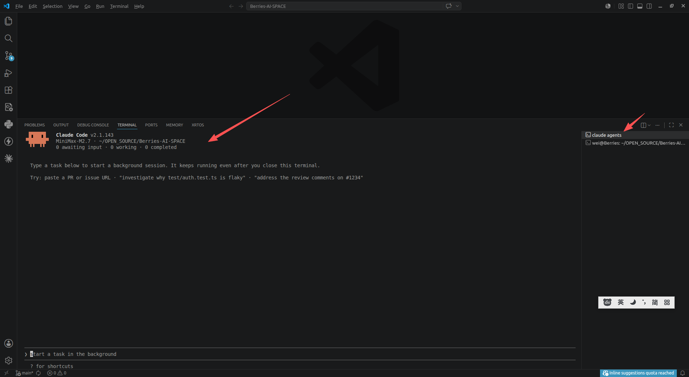
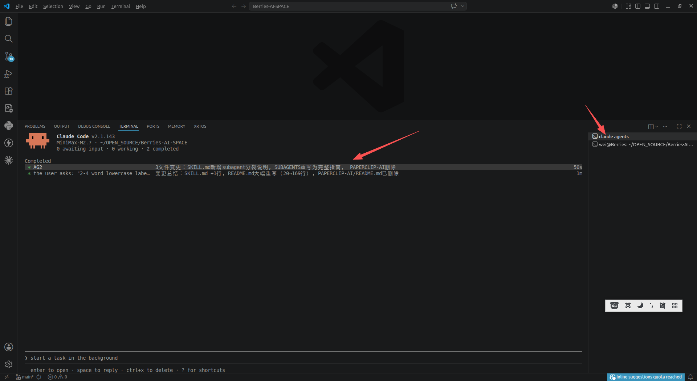

# Agent View (使用 agent view 管理多个代理)
> 版本: 建议升级到最新版

从一个屏幕调度和管理多个 Claude Code 会话。Agent view 显示每个会话正在做什么以及哪些会话需要你的输入。

Agent view 通过 claude agents 打开，是所有后台会话的一个屏幕：什么正在运行、什么需要你的输入、什么已完成。调度新会话，一目了然地查看它们的状态而不是滚动浏览记录，只在需要时才介入。会话在没有终端连接的情况下继续在后台运行。
+ 执行 claude agents 后 ，进入 Claude View
  - 
  - 